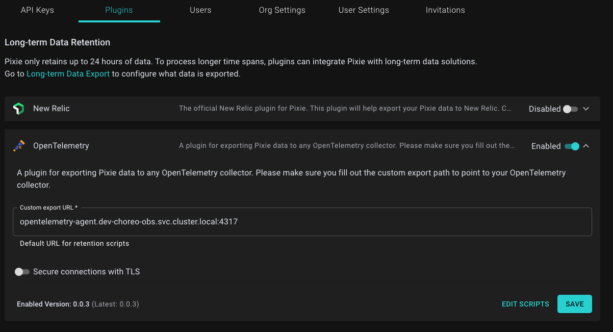
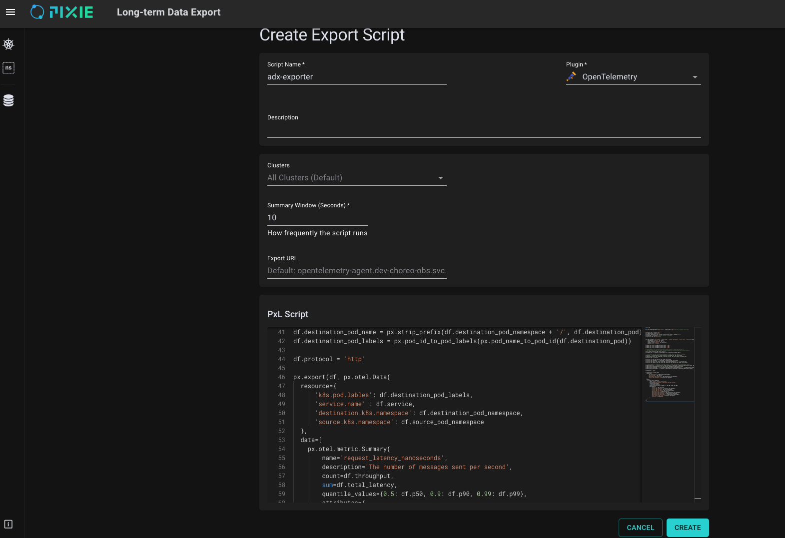
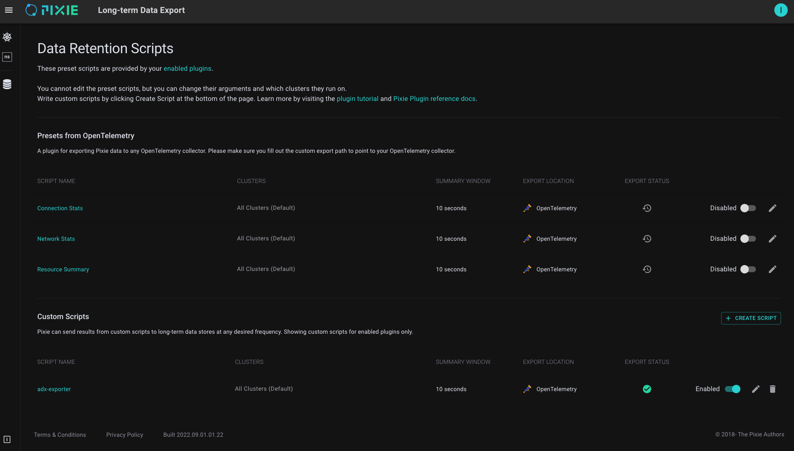

### How to setup pixie agent (in data-planes)

1. Log into pixie admin console `px-cloud.{ENV}.choreo.dev` and create a deploy-key

2. Create `pl` namespace

    kubectl create ns pl

3. Create `pl-deploy-secrets` secret

   kubectl create secret generic -n pl pl-deploy-secrets --from-literal=deploy-key="<deploy-key generated from pixie console>"

4. Apply kustomize overlay

#### Setup Data Retention Script

1. Go to `px-cloud.{ENV}.choreo.dev/admin/plugins`

2. Enable OpenTelemetry Plugin and put `opentelemetry-agent.{ENV}-choreo-obs.svc.cluster.local:4317` as the export URL.

3. Make sure "Secure connections with TLS" is off since pixie will be talking to collector running within the data plane and click "Save".

    

4. Then press "Edit Scripts" and Turn off all plugins under "Presets from OpenTelemetry".

5. Click "Create script" and copy the content of `choreo-control-plane/setup/azure/pixie/pixie-dp/http_request_latency.pxl` to the PxL Script section.

6. Give the `adx-exporter` as the script name and choose OpenTelemetry as the plugin.

7. Change the summary window to `10 seconds` to press create.

    

8. Once everything is configured Data exporter view should looks like this.

    
